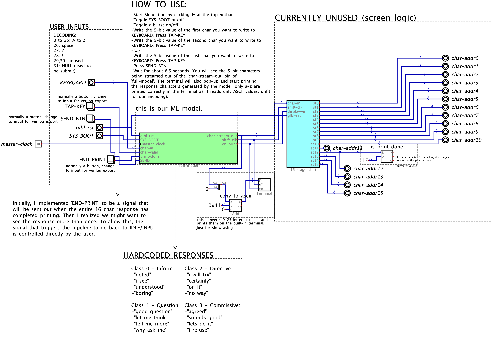
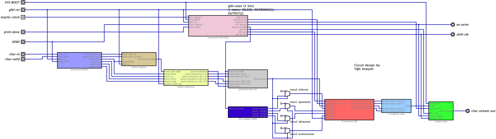

**This is the fully functional Digital Logic implementation of our entire ML pipeline.**

Tool to use: [Digital by HNeemann](https://github.com/hneemann/digital)

-----------------------------------------------------------------------------------------

Simulation file (to test and play around with): [model-w-i-no-o.dig](model-w-i-no-o.dig)

-----------------------------------------------------------------------------------------

ML Model file: [full-model.dig](full-model.dig)

-----------------------------------------------------------------------------------------

## 1. How do I run the simulation?

-Start Simulation by clicking ▶ at the top hotbar.

-Toggle SYS-BOOT on/off.

-Toggle glbl-rst on/off.

-Write the 5-bit value of the first char you want to write to 
KEYBOARD. Press TAP-KEY.

-Write the 5-bit value of the second char you want to write to 
KEYBOARD. Press TAP-KEY.

-(...)

-Write the 5-bit value of the last char you want to write to 
KEYBOARD. Press TAP-KEY.

-Press SEND-BTN.

-Wait for about 6.5 seconds. You will see the 5-bit characters
being streamed out of the 'char-stream-out' pin of 
'full-model'. The terminal will also pop-up and start printing
the response characters generated by the model (only a-z are
printed correctly in the terminal as it reads only ASCII values, unfit
for our encoding).

-Press END-PRINT to stop the output before entering a new prompt.

## 2. What responses should I expect?

Honestly, **you shouldn't expect much.** As our model is a Naive Bayes classifier with 4 classes, there are normally only 4 outputs. But to compensate and give it a more 'live' feel, I added an output generation step that picks a pseudo-random response out of the hardcoded responses defined for the selected class. The possible responses are:

Class 0 - Inform:

-"noted"

-"i see"

-"understood"

-"boring"

Class 1 - Question:

-"good question"

-"let me think"

-"tell me more"

-"why ask me"

Class 2 - Directive:

-"i will try"

-"certainly"

-"on it"

-"no way"

Class 3 - Commissive:

-"agreed"

-"sounds good"

-"lets do it"

-"i refuse"

I'd also like to remind you that the model is weak, like REALLY weak. It has an average precision of about 62%, and that is carried on the shoulders of the Question classifications thanks to the special handling of punctuations. So if you input 'WHY?', you should naturally expect a Question response. But if you input something else, things are more likely to go out of fashion. For example, I said 'IS NICE' (informative) to the guy, and they replied back with 'I WILL TRY'. Felt bad for 'em tbh.

## 3. How does this even work?

Now to the fun (or the hellish) part.
At a high level, the system is a pipelined, hardware-level emulation of a Machine Learning classifier. It doesn't use floating-point math or software loops; it uses raw logic gates, shift registers, and multiplexers. The entire architecture, orchestrated by full_model, is divided into 7 distinct hardware phases.

### Phase 1: The Brain (universal_controller)
This is the master state machine that keeps everything from crashing into each other.

**StateLUT:** Instead of complex nested if-statements, the controller uses a 2-bit 5 input Look-Up Table (LUT) to determine the next state based on your inputs (Submit, Print-Done).

**9bit-loop-counter:** Once you press SEND, the state machine shifts into "Inference Mode" and releases this 9-bit loop counter. It counts exactly from 0 to 259 (one tick for every feature in our ML model) to drive the math engine.

**Clock Dividers (clk-prescaler-cnt & clk-prescaler-cmpr):** It takes the incredibly fast master-clock and scales it down to generate a slow clk-printer so the output characters have time to physically render on the screens. The default configuration is: clk-master = clk-loop = clk-lfsr = 40 hz, clk-printer = 2 hz. 

### Phase 2: Input & Hashing (keyboard_buffer & token_hasher)
When you type a character, it doesn't go straight to the model. We use a hashing trick to avoid storing a massive vocabulary dictionary.

**keyboard_buffer:** Captures your 5-bit keystrokes (char-reg register). It has custom comparator gates listening specifically for Spaces, Question Marks, and Exclamation Points. It also has a 4-bit counter tracking how long your sentence is (punct-long).

**token_hasher:** When you type a letter, an 8-bit register (hash-reg) shifts its binary bits to the left and XORs them with your letter. By the time you hit Space or SEND, the word has been mathematically "scrambled" into a random hardware address between 0 and 255.

### Phase 3: The Memory Latches (token_presence)
Once a word is hashed, the system needs to "remember" that you typed it until the whole sentence is finished.

**demux_decoder_8to256:** A massive routing station. It takes the 8-bit word hash and routes a "1" to exactly one of 256 different wires.

**sticky_reg_bank_64bit:** Four banks of 64-bit registers (totaling 256 bits). Because they have an internal OR-gate feedback loop, once a bit flips to 1, it stays "sticky" (latched) until the master reset clears the sentence. **We had to divide down to 64-bit components from our original 256 bit due to Digital's splitter/merger bit constraints. In Minecraft, these partitions (64 to 256, 256 to 64) used here or in other components don't need to be implemented, UNLESS they specifically divide classes to perform class-oriented operations.**

**Punctuation Latches:** Three direct RS (Set-Reset) latches that catch the ?, !, and >8 words flags bypassing the hash entirely.

### Phase 4: The Loop Selector (presence_bit_sel & full_weight_ROM)
When you hit SEND, the universal_controller starts counting from 0 to 258. For each number, two things happen simultaneously:

**presence_bit_sel**: This is a gigantic 259-to-1 Multiplexer (built from nested Mux_64x1 and Mux_8x1 blocks). It looks at the 259 sticky memory latches and asks: "Did the user type the word associated with slot X?" It outputs a single feat-present bit (1 for Yes, 0 for No).

**full_weight_ROM**: At the exact same time, four parallel ROM banks (weight_bank_8bit_0 through 3) look up the ML model's learned weights for that specific slot. **To remain compatible with Minecraft's barrels' 4-bit limit, each 8-bit weight is physically split across two 4-bit ROMs (lownibblerom and highnibblerom).**

### Phase 5: The Math Engine (4_channel_IAE)
IAE stands for **Inference Accumulator Engine**. This is where the Naive Bayes math physically happens.

**Weight Gating (single_channel_IAE):** For each of the 4 classes, the 8-bit ROM weight is plugged into an AND gate alongside the feat-present bit. If the word wasn't typed, the AND gate forces the weight to 0.

**Sign-Extension:** Naive Bayes log-probabilities are highly negative numbers. The 8-bit signed weight is stretched out into a 17-bit number to prevent integer wrap-around.

**17-bit RCA:** A 17-bit Ripple-Carry Adder (17bit RCA) adds the weight to a running total through a register (17bit accum. reg.), outputted as **accum-class-score**. By the time the controller finishes counting to 259, these four 17-bit registers hold the final mathematical scores for Inform, Question, Directive, and Commissive.

### Phase 6: The Tournament (4_argmax_tree)
You have 4 scores, but you need 1 winner.

**single_trial:** A workaround subtractor. It takes two scores (A and B), inverts B, sets the carry-in to 1, and adds them (B becomes 2s complement). This mathematically computes A - B. It then looks at the sign bit of the answer to see who won, routing the winner forward via a Multiplexer.

**4_argmax_tree:** Arranges three single_trial blocks into a bracket (Semi-Final 1, Semi-Final 2, and the Grand Final) to instantly output the 2-bit ID (fwin) of the highest-scoring class.

### Phase 7: Generative Output (output_gen)
We have the winning class (0 to 3), but we need to print a **conversational response**.

**4bit_PRNG:** A Linear Feedback Shift Register constantly ticking in the background to generate pseudo-random noise.

**rnd_response_addr:** Captures a 2-bit random number the exact moment the inference finishes. It glues the 2-bit winning class ID and the 2-bit random number together to form a 4-bit response address (e.g., Class 1 + Random Variant 2).

**stream_response_char:** Uses a 4-bit counter to sweep through a final text ROM (DIG_ROM_256X5_n5bitROMw256addr). It reads the chosen response out letter-by-letter as 5-bit character codes, routing them to the 16-stage shift register for your viewing pleasure.

## 4. How do we configure the weight data?

The weights are already loaded into their respective ROMs in the .dig circuit. But if you want to do it yourself:

### For this purpose, we have a Python script: [weight_to_hex.py](../weight_to_hex.py)

The script takes out 8-bit weights from the JSON that needs to be located in the same directory (hardcoded filename in-script), separates them to their 4 classes, then divides each 8-bit weight to two 4-bit parts (low and high, to imitate 4-bit barrels ), and writes these sequentially into its respective .hex file that Digital's ROM's will be loaded with. 

You start with this input file: [nb_weights_8bit.json](/nb_weights_8bit.json)

You get these outputs:

-> [inform_low_hex.hex](../hex-files/inform_low_hex.hex)

-> [inform_high_hex.hex](../hex-files/inform_high_hex.hex)

-> [question_low_hex.hex](../hex-files/question_low_hex.hex)

-> [question_high_hex.hex](../hex-files/question_high_hex.hex)

-> [directive_low_hex.hex](../hex-files/directive_low_hex.hex)

-> [directive_high_hex.hex](../hex-files/directive_high_hex.hex)

-> [commissive_low_hex.hex](../hex-files/commissive_low_hex.hex)

-> [commissive_low_hex.hex](../hex-files/commissive_high_hex.hex)

The hex files I generated can be found in the hex-files folder.

Then one by one, you need to 'load' each hex file into the relevant nibble-rom unit inside the four banks (weight-bank-8bit-x) of the full-weight-ROM component.

After loading the data don't forget to save the bank circuit!

## 5. I still need further clarification regarding the functionality of a circuit.

No problem! That's why all of the Verilog exports are for. If you need a general explanation, first go to File -> Export -> Export to Verilog from the top hotbar. Yes, the Verilog exports already exist but they might be outdated unfortunately. So when Digital prompts you of this existence, click 'overwrite'. Now you can feed this Verilog file to whatever LLM you use.

If you need clarification about Digital's default circuit components, you can always ask me first but I'm not much of a wise old hermit on this either, reading the open source documentation would be the best.

Signed off by Thinpine.
